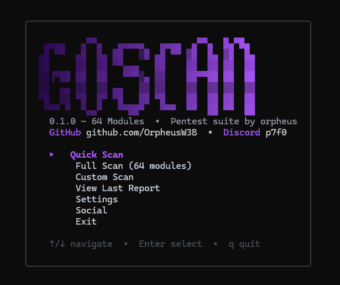

# SCANNER — Multi-Tool Pentest Reconnaissance Suite



**64 modules · 11 categories · TUI + CLI** · _by orpheus_

---

## Features

| Category | Modules | Description |
|----------|---------|-------------|
| **Port Scanning** | 1 | TCP port scan on top 1000 ports with banner grabbing and service detection |
| **DNS Enumeration** | 10 | A, AAAA, MX, NS, CNAME, TXT, SOA, SRV, CAA, PTR records + DNSSEC + zone transfer |
| **Subdomain Discovery** | 2 | crt.sh certificate transparency + 700-entry wordlist brute-force |
| **Email Recon** | 6 | MX lookup, SPF record, DMARC policy, DKIM selector, SMTP open-relay test, common email format generator |
| **WHOIS Lookup** | 1 | Domain registration lookup via who.is / iana.org with structured field extraction |
| **SSL/TLS** | 6 | Certificate parsing, SAN extraction, expiry check, cipher suite scan, protocol version support, Heartbleed check |
| **HTTP Analysis** | 9 | Status/headers, security headers audit, cookie analysis, CORS config, redirect chain, robots.txt, sitemap.xml, favicon hash, full response body |
| **Directory Busting** | 1 | 600-entry wordlist with common extensions (php, asp, aspx, jsp, do, html, bak, zip, tar.gz), page title extraction |
| **Web Tech Detection** | 150+ | Regex patterns across 30+ categories, server header, X-Powered-By, cookie fingerprinting, script src version extraction |
| **GeoIP** | 2 | Geolocation via ip-api.com + PTR reverse DNS lookup |
| **Traceroute** | 1 | Simplified multi-hop TCP traceroute |
| **Login Bruteforce** | 1 | Common credentials test against login forms (42 common user/pass pairs) |

## Interactive TUI

- **Menu** — Quick Scan, Full Scan (64 modules), Custom Scan, View Last Report, Social, Settings, Exit
- **Custom Scan** — Toggle individual modules on/off
- **Live Dashboard** — Real-time per-module status with progress bar and elapsed timer
- **Results View** — Dot-summary table per module, raw JSON toggle
- **Settings** — Configure concurrency, timeouts, port count, output directory

## Installation

```bash
git clone <repo-url> SCANNER
cd SCANNER
go build -o SCANNER.exe .
```

## Usage

**TUI mode** — run with no arguments:
```
SCANNER.exe
```

**CLI mode** — pass a target URL as an argument:
```
SCANNER.exe example.com
```

CLI mode runs all modules and prints a text summary to stdout.

## Output

Reports are saved to the `output/` directory:
- `scan_<timestamp>.json` — Full structured JSON results
- `scan_<timestamp>.html` — Formatted HTML report with dark theme

## Requirements

- Go 1.21+
- Dependencies: charmbracelet/bubbletea, charmbracelet/bubbles, charmbracelet/lipgloss, miekg/dns

## Profiles

- **Quick** — Port scanning, DNS, subdomains, HTTP, WHOIS, SSL (faster subset)
- **Full** — All 64 modules
- **Custom** — User-selected modules

## Connect

```
GitHub  —  github.com/OrpheusW3B
Discord —  p7f0
```

## Disclaimer

For authorized security testing and educational purposes only.
